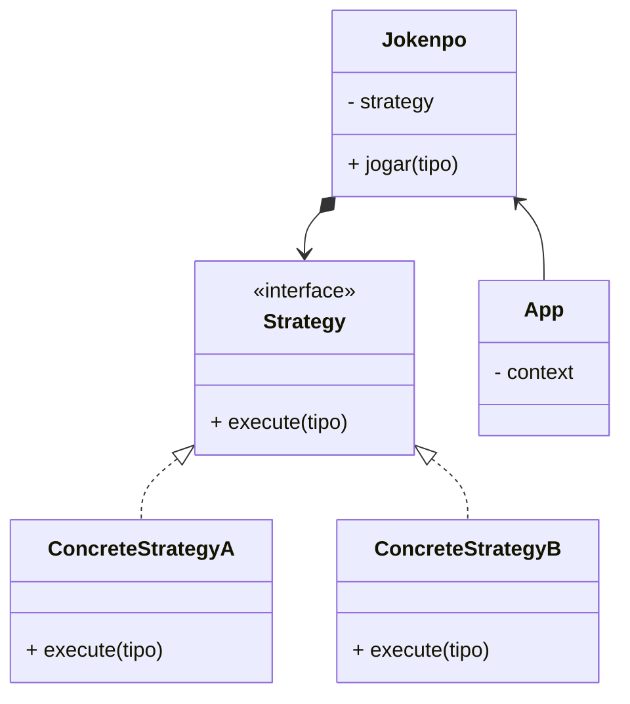

# Desafio JoKenPo

<!--  -->


## Descrição da Atividade

Para este desafio vocês deverão utilizar os conhecimentos adquiridos para resolver da melhor forma possivel uma partida de Jokenpo.

Utilizem a linguagem de sua preferencia e o paradigma de programação ao qual esteja mais confortável.


## Primeira Resolução com Paradigma estruturado.

> Programação Clássica

```java
    public static void main(String[] args) throws Exception {
        Scanner in = new Scanner(System.in);
        System.out.println("Escolha uma das opções [ 1-PAPEL, 2-TESOURA, 3-PEDRA]\n");
        int jogada = in.nextInt();
        int computador = new Random().nextInt(3) + 1;
        System.out.println("O COMPUTADOR escolheu: " + computador);

        if (jogada == 1 && computador == 1) {
            System.out.println("Empate. Papel empata com papel!");
        } else if (jogada == 1 && computador == 2) {
            System.out.println("Perdeu! Tesoura corta o papel!");
        } else if (jogada == 1 && computador == 3) {
            System.out.println("Ganhou! Papel embrulha o pedra!");
        } else if (jogada == 2 && computador == 1) {
            System.out.println("Ganhou. Tesoura corta o papel!");
        } else if (jogada == 2 && computador == 2) {
            System.out.println("Empate! Tesoura empata com tesoura!");
        } else if (jogada == 2 && computador == 3) {
            System.out.println("Perdeu! Pedra quebra a tesoura!");
        } else if (jogada == 3 && computador == 1) {
            System.out.println("Perdeu. Papel embrulha a pedra!");
        } else if (jogada == 3 && computador == 2) {
            System.out.println("Ganhou! Pedra quebra a tesoura!");
        } else if (jogada == 3 && computador == 3) {
            System.out.println("Empatou! Pedra empata com pedra!");
        } 
        in.close();
    }

```

## Design Pattern Strategy


